<div align="center">
  <h1>⚔️ KnightClaw</h1>
  <p><b>Drop-in security armor for OpenClaw — 4 layers of defense, zero complexity.</b></p>
</div>

---

## 🚀 The AI Security Problem (And Why We Exist)

As AI agents become more capable, they become prime targets for attackers. OpenClaw provides the brains, but exposing an unprotected agent to the wild is a massive risk. Prompt injections, secret exfiltration, and unexpected behavior can compromise your systems in seconds.

**KnightClaw is the solution.**

We built the ultimate zero-trust security extension for OpenClaw. Built on a philosophy of "Never Trust, Always Verify," KnightClaw intercepts every request and response, passing it through a rigorous, high-speed 4-layer defense system. If your agent is the brain, KnightClaw is the immune system.

---

## 🏗️ How It Works (At a Glance)

KnightClaw operates as a synchronous interceptor within OpenClaw. Before any tool runs or any model generates text, KnightClaw scrutinizes the data. It uses blazing-fast regex patterns, boundary detection, and a local semantic embedding model—happening entirely on-device, completely private.

```mermaid
flowchart TD
    User([Attacker / User]) -->|Payload| KC{KnightClaw Engine}
    
    subgraph KC_Layers [The 4 Layers of Defense]
    L1[🛡️ Guard 2.0<br>Input Validation]
    L2[📋 Audit Logs<br>Tamper-Proof]
    L3[🔐 Vault<br>Data Encryption]
    L4[🚨 Lockdown<br>Kill Switch]
    
    L1 --> L2
    L2 --> L3
    L3 --> L4
    end
    
    KC -->|Intercepts| KC_Layers
    
    KC_Layers -->|Blocked!| Lockdown[System Locked]
    KC_Layers -->|Safe!| O[OpenClaw Agent Core]
    
    O -->|Executes| Task[Run Task / Tool]
```



---

## 🛡️ The 4 Pillars of Defense

| Layer | Feature | Why It Matters | Status |
|---|---------|-------------|---------|
| **1** | 🛡️ **Guard 2.0** | Blocks prompt injections, malicious inputs, homoglyphs, and jailbreaks using an advanced hybrid heuristics and semantic engine. | Active |
| **2** | 📋 **Logs** | A secure, hash-chained, immutable audit trail. Every action is recorded—tamper-proof. | Active |
| **3** | 🔐 **Vault** | Encrypts all your secrets at rest (AES-256-GCM), ensuring keys are never exposed in plaintext. | Active |
| **4** | 🚨 **Lockdown** | The ultimate emergency kill switch. Detects high-velocity attacks and instantly blocks all operations. | Armed |

*Our guarantee: If one layer fails, 3 others are still guarding the gate.*

---

## ⚡ Installation in 30 Seconds

Getting started is designed to be frictionless. We currently support local installation via the `knightclaw` folder.

```bash
# 1. Navigate to the plugin directory
cd /path/to/knightclaw

# 2. Install dependencies & build
npm install
npm run build

# 3. Load the plugin into OpenClaw (Adds us to your config)
npm run load
```

That's it. KnightClaw is now actively protecting your OpenClaw instance with maximum security.

---

## 🕹️ Command Center (CLI)

KnightClaw comes with a powerful CLI packed right inside OpenClaw. Control your security posture with ease.

### 📊 Dashboard & Status
Check the real-time status of all your security layers.
```bash
openclaw knight status
```

### 🎛️ Feature Toggles
Disable features only when absolutely necessary (requires confirmation).
```bash
openclaw knight enable guard
openclaw knight disable guard --confirm
```

### 📜 Audit Logs
View your tamper-proof, redacted security history.
```bash
openclaw knight logs                 # View recent entries
openclaw knight logs -f              # Follow logs in real-time
openclaw knight logs verify          # Cryptographically verify integrity 
```

### 🚨 Emergency Lockdown
Under attack? Pull the plug. Instantly prevents OpenClaw from taking any action.
```bash
openclaw knight lockdown on          # INSTANT kill switch
openclaw knight lockdown off -y      # Resume operations
```

---

## 🧠 Our Philosophy

1. **Default = Most Secure** — We lock everything down out of the box. You slowly loosen it (if needed).
2. **Never Trust, Always Verify** — Even localhost traffic gets deeply inspected.
3. **Explicit Consent required** — Want to turn off a security feature? You have to `--confirm` it, and we log that decision.
4. **Simple Over Complex** — Security features you don't understand are security vulnerabilities. We keep it incredibly simple.

*Built for Enterprise. Designed for Everyone.* 🛡️
